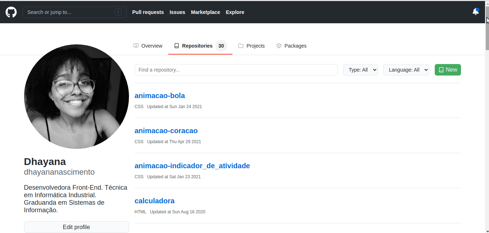

# GitHub - Clone

Este é um projeto com a finalidade de treinar habilidades referentes ao ReactJS, Styled Components e TypeScript. Consiste em um clone da página de repositórios do GitHub (com pequenas alterações).

## Layout



## Tecnologias

- ReactJS
- Styled Components
- Axios

## Linguagens

- TypeScript

## Executar

**Para executar este projeto na sua máquina, execute os seguintes comandos no seu terminal:**

```
$ git clone https://github.com/dhayananascimento/ReactJS-github.git
$ cd ReactJS-github
$ yarn install
$ yarn start
```
